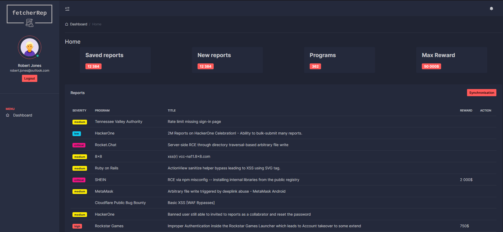

# FetcherREP



This application is designed to retrieve, store and annotate reports from the "Hackerone" platform. FetcherREP was developed by a noob. If you have any tips or suggestions, don't hesitate to contact us!

## Installation

```bash
git clone https://github.com/lucasmartinelle/fetcherRep
```

Build the container & start :

```
docker-compose build
docker-compose up
```

There's no need to configure the application. You can go straight to http://localhost:3000 and use it!
